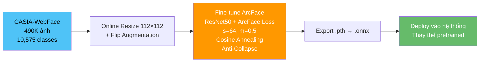
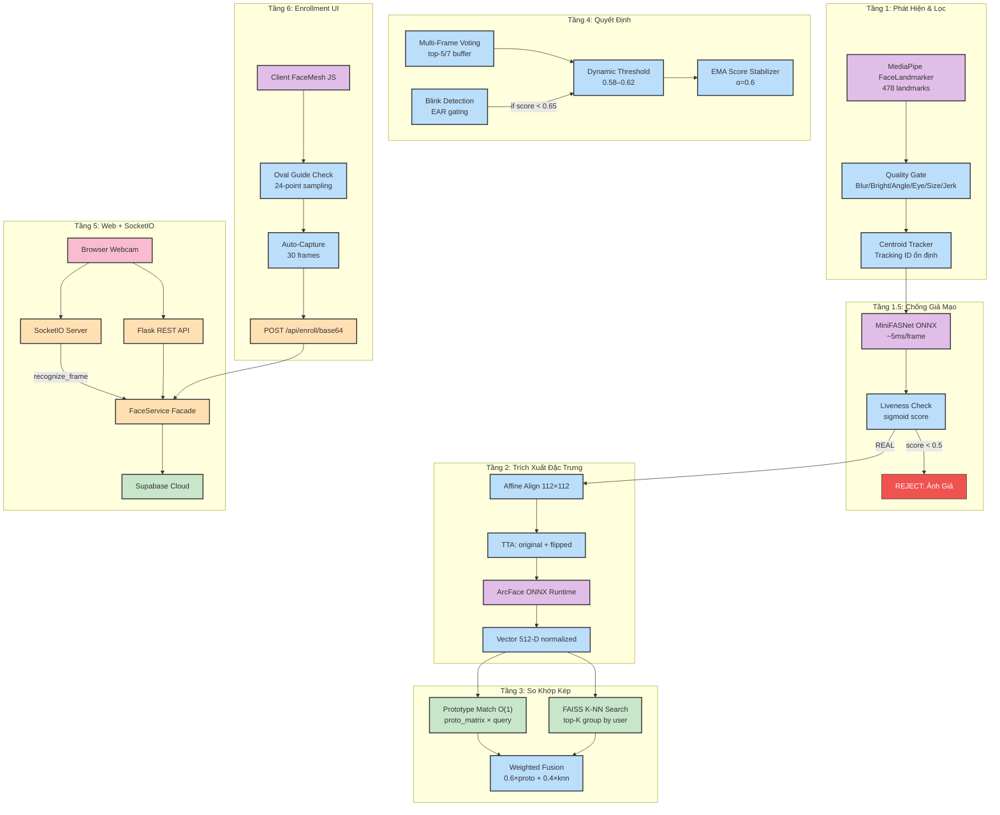
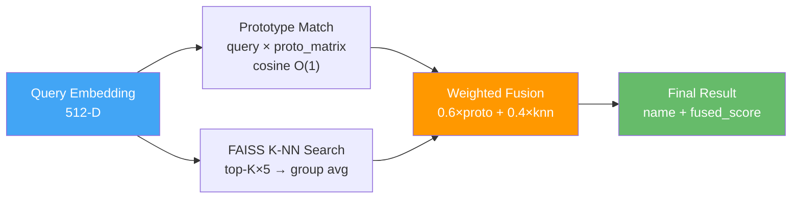
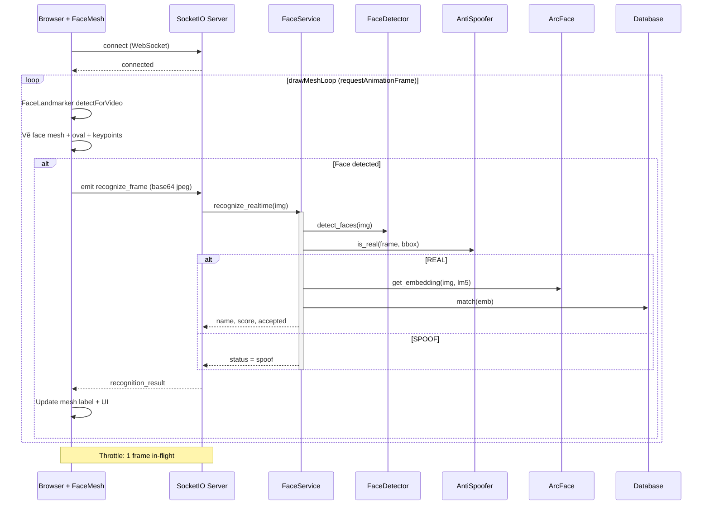
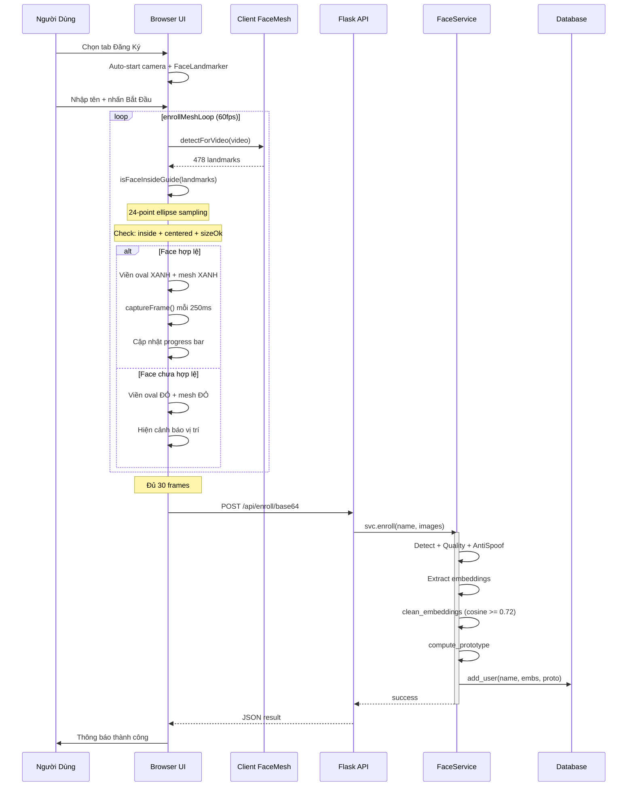
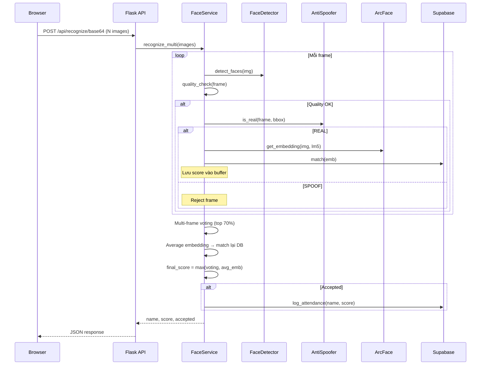

# 🧠 FaceID System — Hệ Thống Nhận Diện & Điểm Danh Khuôn Mặt

> **Phiên bản:** v5.5 · **Cập nhật:** 23/03/2026  
> **Stack:** Python · Flask · SocketIO · MediaPipe · ArcFace · FAISS · Supabase

Hệ thống nhận diện khuôn mặt thời gian thực (real-time) với khả năng đăng ký (enrollment), nhận diện (recognition), chống giả mạo (anti-spoofing), và điểm danh tự động. Hỗ trợ cả giao diện Web (browser) lẫn Desktop (OpenCV).

---

## 📋 Mục Lục

- [Công Nghệ & Mô Hình](#-công-nghệ--mô-hình-sử-dụng)
- [Kiến Trúc Hệ Thống](#️-kiến-trúc-hệ-thống)
- [Luồng Xử Lý](#-luồng-xử-lý-sequence-diagrams)
- [Cấu Trúc Dự Án](#-cấu-trúc-dự-án)
- [Hướng Dẫn Cài Đặt](#-hướng-dẫn-cài-đặt--chạy)
- [Tính Năng Chi Tiết](#-tính-năng-chi-tiết)
- [API Reference](#-api-reference)

---

## 🔬 Công Nghệ & Mô Hình Sử Dụng

### Mô Hình AI (Models)

| Mô hình | Nhiệm vụ | Kiến trúc | Dataset huấn luyện | File | Kích thước |
|---|---|---|---|---|---|
| **ArcFace** | Trích xuất vector đặc trưng 512-D | ResNet-50 + ArcFace Loss (s=64, m=0.5) | CASIA-WebFace (~490K ảnh, 10,575 người) | `arcface_best_model_v4.onnx` | ~94 MB |
| **ArcFace Pretrained** | Dự phòng (backup) | ResNet-50 | MS1MV2 WebFace600K (~600K người) | `w600k_r50.onnx` | ~166 MB |
| **MiniFASNet** | Chống giả mạo (Anti-Spoofing) | MiniFASNet Quantized INT8 | AxonData + OULU-NPU + Replay-Attack + CASIA-FASD | `anti_spoofing_v2_q.onnx` | ~2.5 MB |
| **MediaPipe** | Phát hiện mặt + 478 landmarks | BlazeFace + FaceMesh (FP16) | Google internal dataset | `face_landmarker.task` | ~3.6 MB |

### Training Pipeline



### Tech Stack

| Thành phần | Công nghệ | Mô tả |
|---|---|---|
| Phát hiện mặt | MediaPipe FaceLandmarker 0.10.18 | 478 landmarks, GPU delegate, VIDEO mode |
| Nhận diện mặt | ArcFace ONNX Runtime 1.16+ | TTA (original + flipped), vector 512-D |
| Chống giả mạo | MiniFASNet ONNX (Passive Liveness) | ~5ms/frame, sigmoid scoring |
| Vector search | FAISS IndexFlatIP 1.7.4+ | Cosine similarity, brute-force |
| Database cloud | Supabase PostgreSQL + REST | Embeddings + attendance logs |
| Web server | Flask 3.0 + Flask-SocketIO 5.3 | REST API + WebSocket realtime |
| Frontend | Tailwind 3.4 + Socket.IO 4.7 | SPA, FaceMesh JS client-side |
| Monitoring | Prometheus + Grafana | Metrics: FPS, inference time, reject rate |

---

## 🏗️ Kiến Trúc Hệ Thống

### Sơ Đồ Kiến Trúc Tổng Thể



### Quality Gate — 6 Bộ Lọc Tuần Tự

Mỗi khuôn mặt phải vượt qua **6 bộ lọc** trước khi được nhận diện:

| # | Bộ lọc | Ngưỡng | Mục đích |
|---|---|---|---|
| 1 | **Kích thước mặt** | > 50px, 12–65% frame | Loại mặt quá nhỏ/to |
| 2 | **Độ mờ (Laplacian)** | > 30.0 | Loại ảnh blur, motion blur |
| 3 | **Độ sáng** | Mean 30–230 | Loại ảnh tối/sáng quá |
| 4 | **Góc nghiêng** | < 35° | Loại mặt nghiêng nhiều |
| 5 | **Độ mở mắt (EAR)** | > 0.015 | Loại nhắm mắt |
| 6 | **Rung lắc BBox** | < 80px jerk | Loại đang di chuyển nhanh |

### Dual-Strategy Matching



---

## 🔄 Luồng Xử Lý (Sequence Diagrams)

### 1. Nhận Diện Realtime (SocketIO Streaming)



### 2. Đăng Ký Khuôn Mặt (Enrollment)



### 3. Web API — Multi-Frame Recognition



---

## 📁 Cấu Trúc Dự Án

```
detect/
├── app.py                    # Flask + SocketIO server (~480 dòng)
├── requirements.txt          # Dependencies
├── .env                      # Supabase URL + Key (bí mật)
│
├── core/                     # Module xử lý cốt lõi
│   ├── config.py             # Constants & hyperparameters
│   ├── logger.py             # Centralized logging (rotating file)
│   ├── detector.py           # MediaPipe detection + quality gate + tracking
│   ├── recognizer.py         # ArcFace ONNX + TTA + prototype
│   ├── anti_spoof.py         # MiniFASNet passive liveness
│   ├── matching.py           # Dual-strategy matching engine
│   ├── service.py            # FaceService facade (web ↔ core)
│   ├── database.py           # FAISS + SQLite local
│   ├── supabase_db.py        # FAISS + Supabase cloud
│   ├── pgvector_db.py        # pgvector cloud-native
│   ├── metrics.py            # Prometheus metrics
│   └── main.py               # Desktop app (OpenCV)
│
├── models/                   # Model weights
│   ├── arcface_best_model_v4.onnx   # ArcFace fine-tuned (~94 MB)
│   ├── anti_spoofing_v2_q.onnx      # MiniFASNet quantized (~2.5 MB)
│   └── face_landmarker.task          # MediaPipe (~3.6 MB)
│
├── templates/index.html      # SPA Web UI (~1290 dòng)
├── static/style.css          # CSS + oval guide styles
├── docs/SYSTEM_OVERVIEW.md   # Tài liệu kiến trúc chi tiết
├── scripts/                  # Utility scripts
├── monitoring/               # Grafana + Prometheus configs
├── db/                       # SQLite + FAISS index files
├── logs/                     # Application logs
└── finetune/                 # Fine-tune notebooks
```

### Ma Trận File

| File | Dòng | Trách nhiệm | Dependencies |
|---|---|---|---|
| `config.py` | ~150 | Constants, thresholds, model paths | `numpy` |
| `detector.py` | ~351 | MediaPipe detect, quality gate, tracking | `mediapipe`, `cv2` |
| `recognizer.py` | ~231 | ArcFace ONNX, TTA, prototype, outlier | `onnxruntime`, `cv2` |
| `anti_spoof.py` | ~110 | MiniFASNet liveness, ~5ms/frame | `onnxruntime`, `cv2` |
| `matching.py` | ~105 | Dual-strategy matching (Proto + FAISS) | `numpy`, `faiss` |
| `service.py` | ~470 | FaceService facade + `recognize_realtime()` | all core modules |
| `database.py` | ~170 | FAISS + SQLite local storage | `faiss`, `sqlite3` |
| `supabase_db.py` | ~365 | FAISS + Supabase cloud | `supabase`, `faiss` |
| `app.py` | ~480 | Flask + SocketIO server | `flask_socketio` |
| `index.html` | ~1290 | SPA: Dashboard, Enroll, Recognize, Users | Tailwind, Socket.IO |

---

## 🚀 Hướng Dẫn Cài Đặt & Chạy

### Yêu Cầu

- **Python:** 3.10+
- **OS:** Windows 10/11 (hỗ trợ Linux/Mac)
- **Camera:** Webcam
- **RAM:** 4GB+ (khuyến nghị 8GB)

### Cài Đặt

```powershell
# Clone repository
git clone https://github.com/buitanphat247/demo_iots.git
cd detect

# Tạo & kích hoạt môi trường ảo
python -m venv face_env
.\face_env\Scripts\Activate.ps1    # Windows PowerShell
# source face_env/bin/activate     # Linux/Mac

# Cài đặt thư viện
pip install -r requirements.txt
```

### Cấu Hình `.env`

```env
SUPABASE_URL=https://your-project.supabase.co
SUPABASE_KEY=your-anon-key
DB_BACKEND=supabase          # hoặc: sqlite, pgvector
```

### Chạy

**Giao diện Web (Khuyên dùng):**
```powershell
python app.py
```
🌍 Mở trình duyệt: **http://127.0.0.1:5000**

**Giao diện Desktop (OpenCV):**
```powershell
python core/main.py
```

---

## ✨ Tính Năng Chi Tiết

### 🖥️ Web UI Tabs

| Tab | Chức năng |
|---|---|
| **Dashboard** | Thống kê: số người dùng, vectors, FAISS index |
| **Đăng Ký** | Camera + FaceMesh + Oval Guide → auto-capture 30 frames |
| **Nhận Diện** | SocketIO realtime: face mesh + nhận diện tức thì |
| **Người Dùng** | CRUD người dùng + xem embeddings |
| **Điểm Danh** | Lịch sử chấm công với timestamp |

### 🛡️ Anti-Spoofing

- **Passive Liveness** — không yêu cầu hành động từ người dùng
- Phát hiện: ảnh in, điện thoại, video replay, 3D mask
- ~5ms/frame, sigmoid overflow protection

### 📷 Smart Enrollment

- **Oval Guide** overlay (CSS cutout) hiển thị vùng đặt mặt
- **FaceMesh client-side** check vị trí real-time (24-point ellipse)
- **3 điều kiện**: inside oval + centered + size OK
- Camera tự bật/tắt theo tab
- Auto-capture 30 frames × 250ms khi valid

### ⚡ SocketIO Realtime

- WebSocket streaming, không polling
- FaceMesh vẽ mesh + keypoints real-time
- Mesh **xanh** = recognized, **đỏ** = unknown
- 1-frame-in-flight throttle
- Anti-jitter rendering

---

## 📡 API Reference

### REST Endpoints

| Method | Endpoint | Mô tả |
|---|---|---|
| `GET` | `/api/info` | Thông tin hệ thống |
| `GET` | `/api/users` | Danh sách người dùng |
| `POST` | `/api/enroll/base64` | Đăng ký `{name, images[]}` |
| `POST` | `/api/recognize/base64` | Nhận diện `{images[]}` |
| `DELETE` | `/api/users/<name>` | Xóa người dùng |
| `GET` | `/api/attendance` | Lịch sử điểm danh |
| `GET` | `/metrics` | Prometheus metrics |

### SocketIO Events

| Event | Hướng | Data |
|---|---|---|
| `recognize_frame` | Client → Server | `{image: base64_jpeg}` |
| `recognition_result` | Server → Client | `{name, score, accepted, status}` |
| `enroll_check_face` | Client → Server | `{image: base64_jpeg}` |
| `enroll_face_status` | Server → Client | `{face_ok, in_oval, quality_ok}` |

---

## 📊 Performance

| Metric | Giá trị |
|---|---|
| Detection (MediaPipe) | ~8ms/frame |
| Anti-Spoofing (MiniFASNet) | ~5ms/frame |
| Embedding (ArcFace ONNX CPU) | ~15ms/face |
| FAISS Search (100 users) | ~1ms |
| E2E SocketIO latency | ~50–80ms |
| Enrollment (30 frames) | ~10 giây |

---

## 📝 Changelog

| Version | Ngày | Nội dung |
|---|---|---|
| **v5.5** | 23/03/2026 | SocketIO realtime, FaceMesh enrollment + oval guide |
| **v5.4** | 21/03/2026 | Dynamic threshold, blink gating, ArcFace v4 |
| **v5.3** | 20/03/2026 | Anti-false-accept, EMA tuning, batch embedding |
| **v5.2** | 19/03/2026 | Service facade, logging, Prometheus, pgvector |
| **v5.1** | 19/03/2026 | 11/12 bug fixes, matching engine extract |

---

## 📄 License

Dự án phục vụ mục đích học tập và nghiên cứu.

## 👤 Tác Giả

**Bùi Tấn Phát** — [GitHub](https://github.com/buitanphat247)
