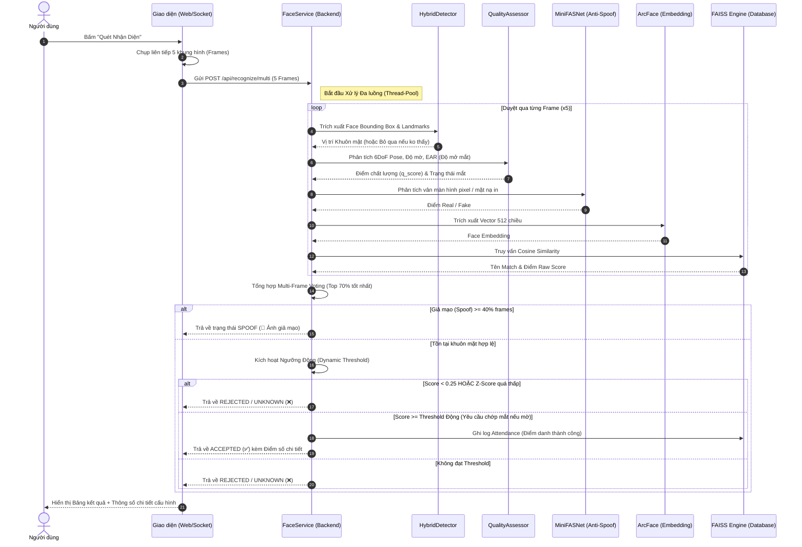
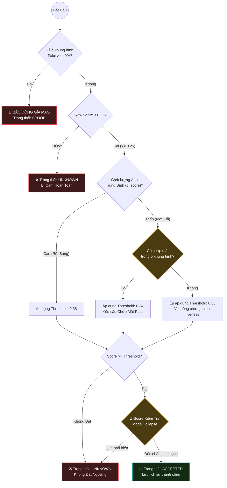

# Cơ Chế Nhận Diện & Quyết Định "Unknown" (Face Recognition Logic)

Tài liệu này giải thích chi tiết cơ chế hoạt động đằng sau hệ thống nhận diện khuôn mặt v5.12, đặc biệt tập trung vào cách hệ thống đưa ra quyết định **Chấp nhận (Accepted)**, **Từ chối (Rejected/Unknown)**, và **Giả mạo (Spoofing)**.

---

## 1. Tổng Quan Luồng Xử Lý Đa Khung Hình (Multi-Frame Voting)

Hệ thống không đánh giá dựa trên một bức ảnh duy nhất để tăng tối đa độ chính xác và tính bảo mật. Khi bạn nhấn "Quét Nhận Diện", hệ thống sẽ thu thập liên tiếp **5 khung hình (Frames)** trong một khoảng thời gian cực ngắn (~150ms) và thực hiện đánh giá đồng thời:

1. **Phát hiện khuôn mặt:** Dùng Hybrid Detector (SCRFD + MediaPipe) để tìm vị trí.
2. **Đánh giá chất lượng (Face Quality):** Đo độ mờ, độ sáng, tư thế góc nghiêng (6DoF Pose).
3. **Chống giả mạo (Anti-Spoofing):** Dùng MiniFASNet kiểm tra xem đây là người thật hay là hình chụp/thiết bị điện tử.
4. **Trích xuất đặc trưng (Embedding):** Đưa qua ArcFace Model để tạo vector 512 chiều.
5. **Tìm kiếm (FAISS Match):** So sánh vector với cơ sở dữ liệu để tìm ra người giống nhất và **Độ trùng khớp (Cosine Similarity)**.

---

## 2. Hệ Thống Ngưỡng Động (Dynamic Thresholds)

Thuật toán đo lường mức độ khớp nhau bằng giá trị **Cosine Similarity** (Độ Trùng Khớp). Giá trị này chạy từ `0.0` (không giống chút nào) đến `1.0` (giống y hệt hoàn toàn).

Hệ thống của chúng ta áp dụng cơ chế đánh giá **Ngưỡng Động (Dynamic Threshold)**, nghĩa là ngưỡng yêu cầu khó hay dễ sẽ tuỳ thuộc vào chất lượng bức ảnh thực tế của người dùng:

*   **Ngưỡng Cao (High Quality Threshold = 0.38):**
    Áp dụng khi khuôn mặt đủ sáng, rõ nét, không bị nhòe. Nếu **Điểm Trùng Khớp >= 0.38**, hệ thống sẽ `ACCEPTED`.

*   **Ngưỡng Thấp (Low Quality Threshold = 0.34 + Yêu Cầu Chớp Mắt):**
    Áp dụng khi môi trường thiếu sáng, camera bị mờ, khiến điểm số tối đa khó vượt qua 0.38. Lúc này hệ thống **hạ tiêu chuẩn xuống 0.34**, nhưng bù lại **YÊU CẦU** trong 5 khung hình người dùng phải có hành động **chớp mắt (Blink)** để chứng minh liveness bổ sung.

*   **Ngưỡng Từ Chối Bắt Buộc (Reject Threshold = 0.25):**
    Dưới mốc **0.25**, hệ thống chắc chắn 100% đây là "người lạ" hoặc ảnh quá tệ sinh ra nhiễu cao. Kết quả trả về sẽ luôn là **Unknown**.

---

## 3. Tại Sao Lại Sinh Ra Kết Quả "Unknown" (Không Xác Định)?

Khác với các hệ thống phổ thông nhận diện bừa một người giống nhất vào mọi lúc. Hệ thống giới hạn vùng an toàn rất khắt khe để tránh việc **Nhận diện Sai (False Accept)**:

Kết quả sẽ bị trả về trạng thái **Unknown / Thuộc tính chưa xác minh** trong các trường hợp sau:

1. **Người lạ lọt vào camera:** 
   Điểm nhận diện (Cosine Similarity) đối với Database quá thấp (dưới mức `0.38`). Đặc biệt nếu điểm < `0.25`, FAISS Engine lập tức loại bỏ.
   
2. **Bị Mờ, Nhòe nhưng Không Chớp Mắt:** 
   Giả sử môi trường mờ, điểm số đạt mức `0.36`. Mức này thấp hơn Threshold `0.38`, nhưng thuộc diện "Ngưỡng Hạ Thấp (`0.34`)". Dẫu vậy, nếu trong suốt 5 frame bạn **KHÔNG CHỚP MẮT**, hệ thống sẽ nghĩ điểm `0.36` có thể là do thẻ giấy rọi trước camera, nên nó quyết định **Unknown**.
   
3. **Cohort Normalization (Chống Mode Collapse):** 
   Một hiện tượng hiếm xảy ra do AI là một khuôn mặt quá chung chung (ánh sáng chói lóa mất hết nét) có thể sinh ra điểm giống với tất cả mọi người. Hệ thống phát hiện hiện tượng này bằng cách đo Z-Score (so sánh sự phân biệt giữa đám đông). Nếu nó thấy ảnh này "giống quá nhiều người", nó lập tức đánh tụt điểm để đưa về **Unknown**.

---

## 4. Cơ Chế Loại Bỏ Tấn Công Giả Mạo (Spoofing)

Nếu bạn đưa màn hình điện thoại hoặc ảnh in chứa hình của `buitanphat` ra trước Camera:

*   **Không dính lỗi Unknown:** Điểm Cosine Similarity của ảnh giấy so với Database chắc chắn sẽ CỰC KỲ CAO (Vd: `0.80+`) và dễ dàng vượt qua ngưỡng `0.38`. Tại sao? Vì bức ảnh trên điện thoại đúng thật sự là mặt người đó.
*   **Bị đánh trượt ở GATE LIVENESS:** Model MiniFASNet trong luồng đa khung hình phát hiện các đường vân pixel (moiré effect) của màn hình, hay viền khung tranh ảnh. Nó gán nhãn khung hình đó là **Spoof**. 
*   **Final Quyết Định:** Dù Similarity là **0.80+**, tổng phiên (session) bị cắm cờ `SPOOF`, nó đè lên kết quả ACCEPTED, ép đầu ra chuyển sang nhãn hiệu **"Ảnh giả mạo — 📵 REJECTED"**.

---

## 5. Tổng Kết Luồng Đánh Giá (Decision Tree)

1. `Similarity < 0.25` ➔ ❌ Trực tiếp `Unknown`.
2. `Phát hiện Giả mạo > 40% số khung` ➔ 📵 `SPOOF` (Ảnh giả mạo).
3. `Chất lượng cao` + `Similarity >= 0.38` ➔ ✅ `ACCEPTED`.
4. `Chất lượng thấp` + `Có chớp mắt` + `Similarity >= 0.34` ➔ ✅ `ACCEPTED`.
5. `Chất lượng thấp` + `Không chớp mắt` + `Similarity < 0.38` ➔ ❌ `Unknown` (Yêu cầu chớp mắt).
6. Tên Match bị đánh dấu "quá phổ thông" (Z-Score) ➔ Điểm bị gọt phăng ➔ ❌ `Unknown`.

---

## 6. Sơ Đồ Trình Tự Giao Tiếp (Sequence Diagram)

Sơ đồ dưới đây mô tả quá trình từ lúc người dùng ấn nút "Quét Nhận Diện" cho tới khi nhận được kết quả cuối cùng.

---

## 7. Lưu Đồ Quyết Định Hệ Thống (Decision Flowchart)

